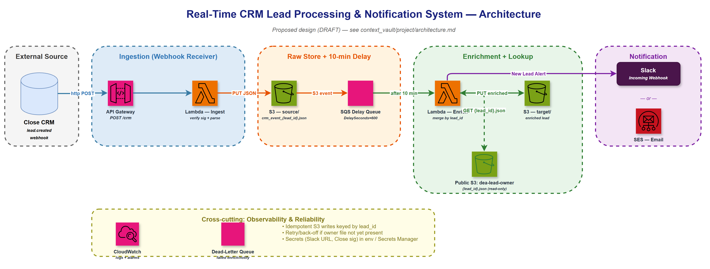

# Real-Time CRM Lead Processing and Notification System

An event-driven, serverless pipeline on AWS that captures newly-created leads from
the **Close CRM** via webhook, buffers them ~10 minutes so the CRM can assign a lead
owner, enriches them against a public S3 lookup, and notifies the sales team in
**Slack** — within seconds of the lead landing.

## Architecture



```
Close CRM ──webhook──▶ API Gateway ─▶ Lambda (Ingest) ─PUT─▶ S3 source/
 (lead.created)         POST /crm       parse event       crm_event_{lead_id}.json
                                                                │ S3 event
                                                                ▼
                                                        SQS Delay Queue (600s)
                                                                │ after 10 min
                                                                ▼
   Public S3: dea-lead-owner ◀─GET {lead_id}.json─ Lambda (Enrich) ─PUT─▶ S3 target/
                                                       merge by lead_id
                                                                │ New Lead Alert
                                                                ▼
                                                             Slack
```

Design decisions are recorded in `context_vault/decisions/` (ADR-001). The source
`.drawio` for the diagram is at [docs/architecture_diagram.drawio](docs/architecture_diagram.drawio).

## Status

| Phase | Scope | Status |
| --- | --- | --- |
| 0 | Project setup | ✅ |
| 1 | Project scaffold (this commit) | ✅ |
| 2 | Webhook ingestion → S3 `source/` (FR1, FR2) | ✅ |
| 3 | 10-min delay + lookup + enrichment → S3 `target/` (FR3, FR4) | ✅ |
| 4 | Slack notification + error handling/retries/logging (FR5) | ✅ |
| 5 | Docs + end-to-end validation | ⬜ |

## Prerequisites

| Tool | Version | Notes |
| --- | --- | --- |
| Python | 3.11 | Matches the `python3.11` Lambda runtime |
| AWS CLI | v2 | Configured for region `us-east-1` |
| AWS SAM CLI | 1.16x | Build + deploy the stack |
| Docker | (optional) | Only for `sam local invoke` / `sam local start-api` |

## Project structure

```
template.yaml          # AWS SAM infrastructure (API Gateway, Lambda, S3, …)
samconfig.toml         # SAM build/deploy defaults (stack name, region)
src/
  common/              # shared config, JSON logging, S3, lookup, Slack
  ingest/app.py        # Ingest Lambda — Close webhook receiver (FR1/FR2)
  enrich/app.py        # Enrich Lambda — owner lookup + merge + Slack alert (FR3/FR4/FR5)
  requirements.txt     # runtime deps bundled by `sam build`
tests/                 # pytest suite
requirements-dev.txt   # local/CI deps (pytest, ruff, mypy, moto)
pyproject.toml         # ruff / mypy / pytest config
.github/workflows/     # CI (lint, type-check, test, sam validate)
docs/                  # requirements doc + architecture diagram
```

## Local development

```bash
# create a virtual environment and install dev deps
python -m venv .venv
.venv\Scripts\activate          # Windows (PowerShell: .venv\Scripts\Activate.ps1)
pip install -r requirements-dev.txt

# lint, type-check, test
ruff check .
mypy src
pytest
```

## Build & deploy (AWS SAM)

```bash
sam validate --lint
sam build
sam deploy --guided      # first time; afterwards just `sam deploy`

# pass the Slack webhook for New Lead Alerts (kept out of source / git):
sam deploy --parameter-overrides SlackWebhookUrl=https://hooks.slack.com/services/XXX/YYY/ZZZ
```

The stack outputs an **`ApiUrl`** (`.../Prod/crm`). That public URL is what gets
registered as the Close webhook subscription (coordinate with Azmat/Ninad to create
it once the URL exists).

The Slack webhook URL is a `NoEcho` parameter (`SlackWebhookUrl`); leave it empty to
deploy without notifications. The Enrich Lambda skips the alert when it is unset.
